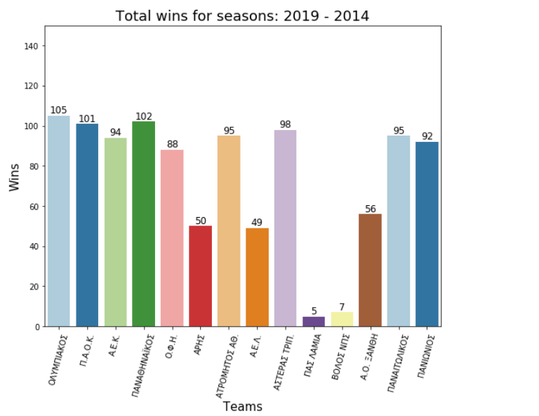

# Web_scrapping_and_Visualizations
Demostration of a web scrapper for grapping the Greek Championship results and Visualize the information.

*  First, we built a scraper to grap all the information (championship tables ) from the National Greek Football Championship site (6 year results)

[scraper.py](https://github.com/TzavarasIoannis/Web_scraping_and_Visualizations/web-scraper.py) 

* Next, we write well formed csv's files for each table-year

[export_csv.py](https://github.com/TzavarasIoannis/Web_scraping_and_Visualizations/export_csv.py) 

* Then, we visualize some of the results 

[visualizations.py](https://github.com/TzavarasIoannis/Web_scraping_and_Visualizations/visualizations.py) 

*The images below are a part of the work *

 

 
